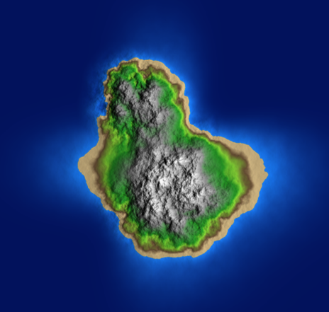
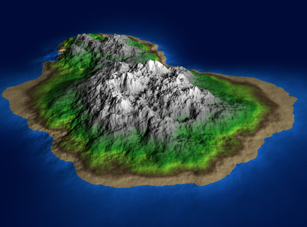

 

## AUTHORS
Mohammad Rehman
Liam Agar

## INSTRUCTIONS

1. Create a new OpenFrameworks project using the Project Generator. 
Under 'addons,' be sure to add OfxGui
2. Place all files in the src/ directory into the src/ folder in the project
3. Place the shader/ folder in bin/data/ in the OpenFrameworks project
4. Run the program

## UI Information

- Press ' ' to toggle between the 3D mode and the heightmap mode
- Press 'g' to toggle UI
- Adjust the parameters in the top right however you like, and press 'Regenerate'
to generate a new terrain

## ABOUT

Traditional fall-off maps, while simple to implement, often create unrealistically circular or
symmetrical terrain features. This is because they typically use a radial gradient that decreases
uniformly from the center point, resulting in islands that appear artificially round and mountains
that lack the irregular shapes found in nature. Our implementation addresses these limitations
through a polygonal approach to fall-off calculation. Instead of using simple radial gradients, we
define our fall-off using a collection of connected vertices that form an irregular boundary. The
fall-off value is calculated by comparing a point's actual distance to its expected distance along
that boundary, allowing us to create more natural, asymmetric shapes while maintaining smooth
transitions in elevation.

The base island shape is created using a polygon with a distorted boundary, providing an
irregular foundation that avoids the circularity common to traditional methods. Mountain ranges
are positioned using additional polygons with controlled randomness, each contributing its own
fall-off pattern. Multiple layers of noise are then applied with varying frequencies and
amplitudes, while custom bias functions create realistic transitions.
For mountain ranges, we extend the polygon concept by using multiple overlapping distorted
shapes. The shapes are positioned with controlled randomness and varying parameters. By
combining these irregular fall-off patterns with layered noise functions, we achieve terrain that
captures the controlled yet irregular features of real island topography.

